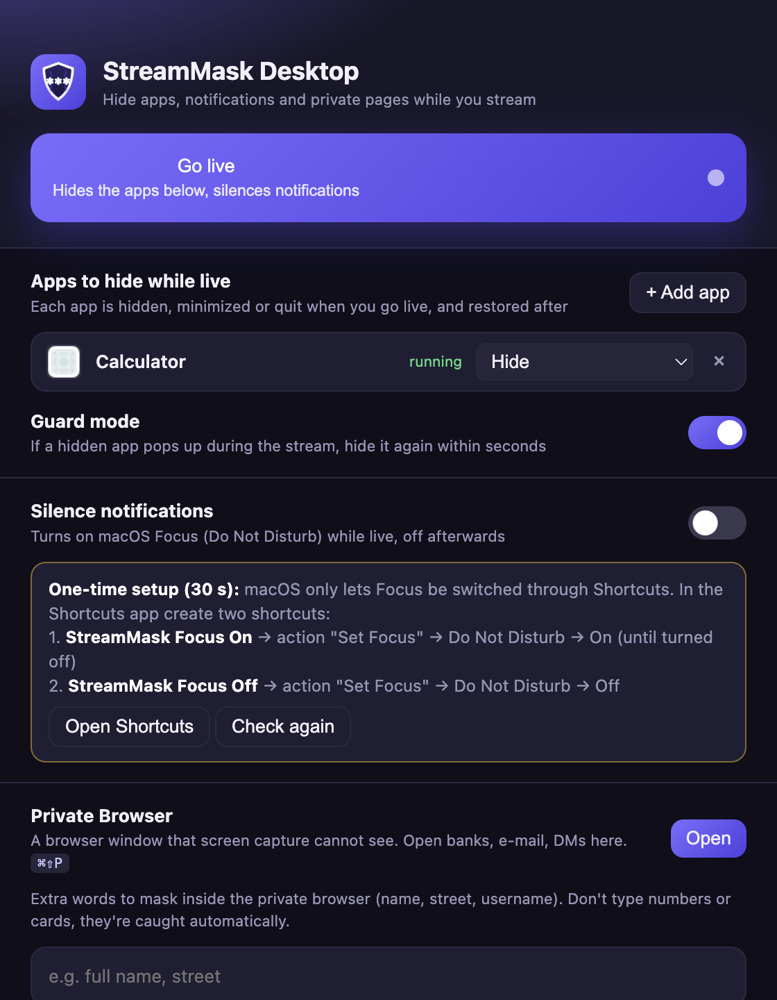

# StreamMask Desktop

Open-source stream privacy tool for macOS. One click before you go live:

- **Hides the apps you choose** (WhatsApp, Mail, Telegram, Discord, Slack…) – hide, minimize or quit, and restores them when the stream ends.
- **Guard mode** – if a hidden app pops up during the stream, it is hidden again within seconds.
- **Silences notifications** – switches macOS Focus (Do Not Disturb) on while live, off afterwards.
- **Private Browser** – a browser window that **screen capture cannot see**. Open your bank, e-mail or DMs there; OBS, Discord, Zoom, Meet and macOS screen recording show nothing, even when you share the whole screen. Personal info on pages inside it is masked with `*****` as well (same engine as the [StreamMask Chrome extension](https://github.com/KursadEren/streammask)).
- StreamMask's own windows are excluded from capture too.

Nothing leaves your machine: no server, no accounts, no analytics. Settings live in a local JSON file.



## Install

Download the latest `.dmg` from [Releases](https://github.com/KursadEren/streammask-desktop/releases), drag StreamMask Desktop to Applications.
The app is not notarized yet; on first launch right-click → Open, or run `xattr -dr com.apple.quarantine "/Applications/StreamMask Desktop.app"`.

### Permissions (macOS asks once)
- **Automation → System Events** and **Accessibility**: needed to hide / minimize / quit other apps. macOS shows the prompt the first time you go live.
- **Focus**: macOS has no public API for Do Not Disturb, so StreamMask runs two Shortcuts you create once (30 seconds): `StreamMask Focus On` (Set Focus → Do Not Disturb → On until turned off) and `StreamMask Focus Off` (Set Focus → Do Not Disturb → Off). The panel tells you when they are detected.

## Shortcuts
- `⌘⇧L` go live / end stream
- `⌘⇧P` show / hide the Private Browser
- Inside the Private Browser: `⌘T` new tab, `⌘W` close tab, `⌘L` address bar, `⌘R` reload

## How the invisibility works
The Private Browser window is created with content protection (`NSWindow.sharingType = .none` on macOS, `WDA_EXCLUDEFROMCAPTURE` on Windows). Screen-capture APIs skip such windows entirely: they are blank or absent in recordings and shares, while you see them normally on your monitor.

Limits: an HDMI capture card or a camera pointed at the monitor still sees everything. Existing tabs in your normal Chrome cannot be hidden – open sensitive sites in the Private Browser instead.

## Run from source
```bash
npm install
npm start
```
Build a `.dmg`: `npm run dist` (output in `dist/`).

## Windows
The same content-protection call exists on Windows 10 2004+; app hiding uses different APIs and is not implemented yet. Contributions welcome.

## License
MIT
